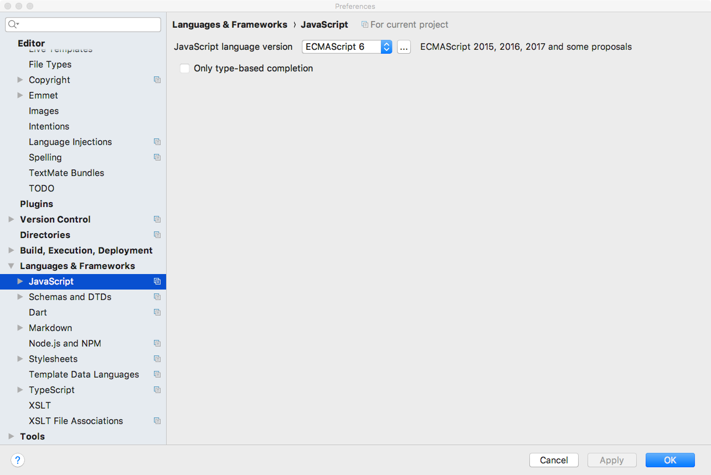
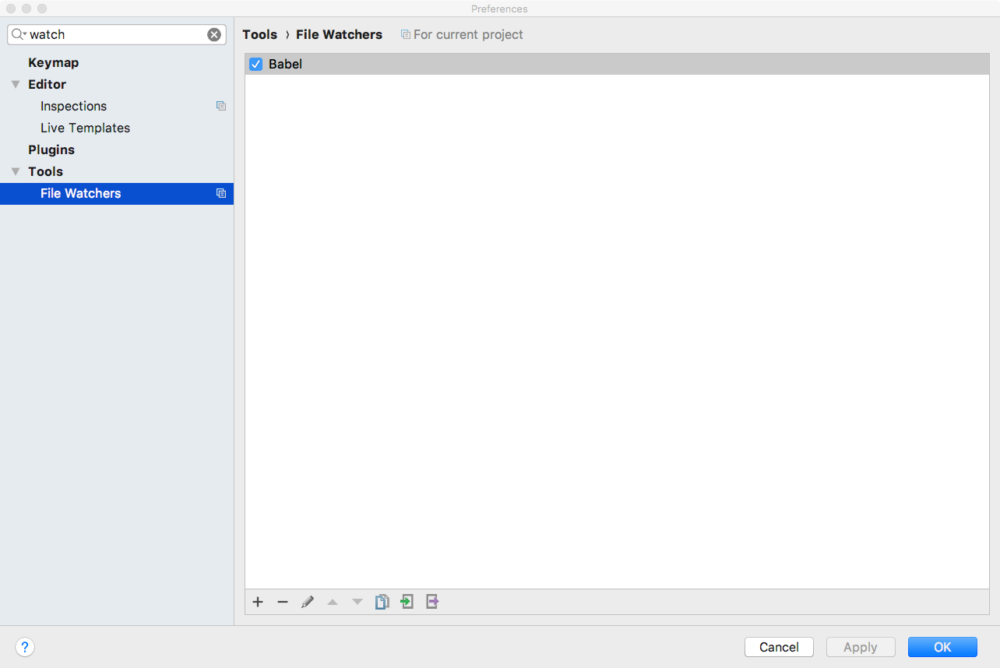
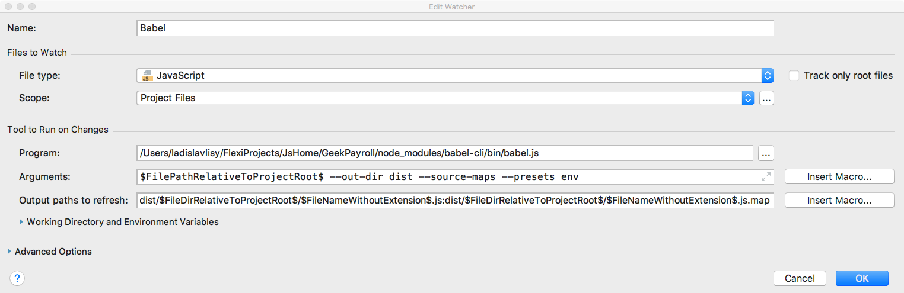
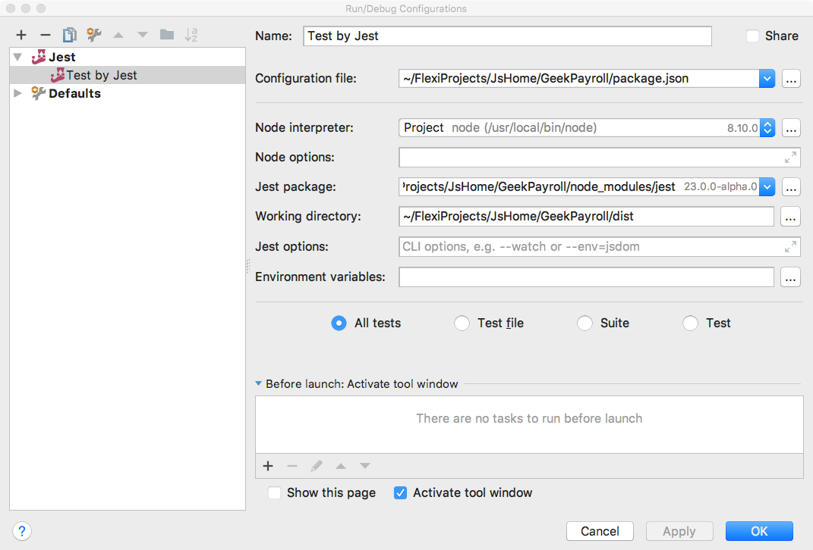

# Project Bootstrap
[Jest in Webstorm](https://www.jetbrains.com/help/webstorm/jest.html)

[Jest website](https://facebook.github.io/jest/docs/en/getting-started.html)

### npm dependencies (terminal)
    npm install --save-dev babel-cli babel-preset-env
    npm install --save-dev jest ts-jest @types/jest
    npm install --save-dev babel-jest
    npm install --save-dev babel-core
    npm install --save-dev regenerator-runtime

### Config Webstorm Preferences

### Config Webstorm Task

